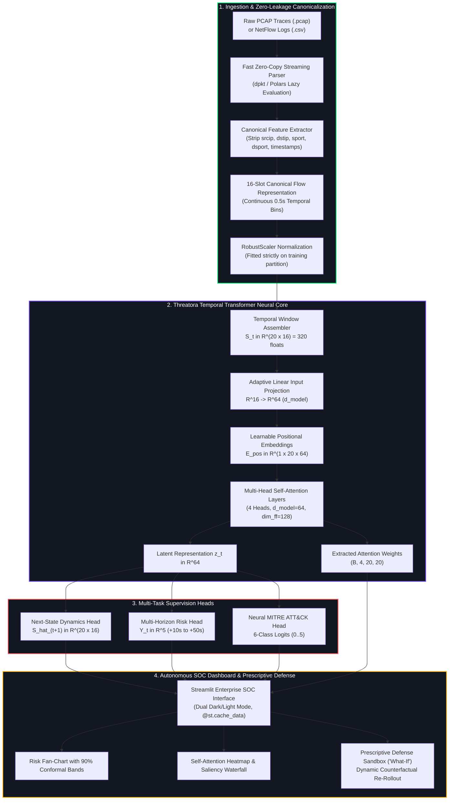
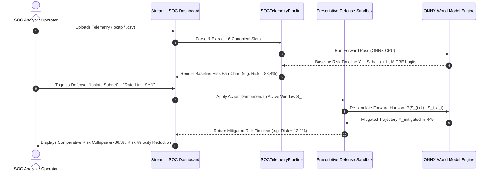

<div align="center">

<pre>
<font color="#FF3333">████████╗██╗  ██╗██████╗ ███████╗ █████╗ ████████╗ ██████╗ ██████╗  █████╗ </font>
<font color="#FF5555">╚══██╔══╝██║  ██║██╔══██╗██╔════╝██╔══██╗╚══██╔══╝██╔═══██╗██╔══██╗██╔══██╗</font>
<font color="#FFBE0B">   ██║   ███████║██████╔╝█████╗  ███████║   ██║   ██║   ██║██████╔╝███████║</font>
<font color="#00F5D4">   ██║   ██╔══██║██╔══██╗██╔══╝  ██╔══██║   ██║   ██║   ██║██╔══██╗██╔══██║</font>
<font color="#3B82F6">   ██║   ██║  ██║██║  ██║███████╗██║  ██║   ██║   ╚██████╔╝██║  ██║██║  ██║</font>
<font color="#8ECAE6">   ╚═╝   ╚═╝  ╚═╝╚═╝  ╚═╝╚══════╝╚═╝  ╚═╝   ╚═╝    ╚═════╝ ╚═╝  ╚═╝╚═╝  ╚═╝</font>
</pre>

<br/>
<font color="#8ECAE6"><i>National Technical Research Organisation (NTRO) &middot; Defense Problem Statement 26153</i></font>
<br/>
<b>Autonomous AI-Based Proactive Network Attack Forecasting Platform</b>
<br/><br/>

[](https://www.sih.gov.in/)
[](https://ntro.gov.in/)
[](https://python.org)
[](https://pytorch.org)
[](https://onnxruntime.ai)
[](https://github.com)

<br/>

**Threatora** is a proactive, air-gapped network defense platform powered by the **Threatora Temporal Transformer World Model**. Unlike legacy intrusion detection systems (NIDS) that trigger reactive alerts only *after* an intrusion signature is observed, Threatora autoregressively models network state dynamics $P(S_{t+1} \mid S_t)$ over continuous temporal windows. It forecasts multi-horizon breach risk vectors $Y_t \in \mathbb{R}^5$ up to 50 seconds ahead with a **Mean Lead-Time to Compromise (MLTC) of 47s+ @ <0.1% False Positive Rate (FPR)**, classifies the active MITRE ATT&CK kill-chain stage via a neural classification head, and enables automated counterfactual defense simulation in an interactive SOC dashboard.

<br/>

[Executive Summary](#-executive-summary) •
[Threatora vs Traditional NIDS](#-threatora-vs-traditional-nids) •
[Architecture & Pipelines](#-system-architecture) •
[16-Slot Canonical Schema](#-16-slot-canonical-feature-schema) •
[Multi-Horizon Supervision & Neural MITRE Head](#-multi-horizon-supervision--neural-mitre-head) •
[Streamlit SOC Dashboard](#-streamlit-soc-dashboard) •
[Empirical Validation & Zero-Day Benchmark](#-empirical-validation--benchmarking) •
[Quick Start](#-quick-start)

---

</div>

## 🎯 Executive Summary

Modern Advanced Persistent Threats (APTs), zero-day exploits, and coordinated multi-stage cyber campaigns exploit the fundamental latency gap of traditional security infrastructure: **by the time a signature matches or a point-in-time anomaly detector fires, initial access has already occurred and lateral movement is underway**.

**Threatora** solves **NTRO Problem Statement 26153** by introducing the **Network World Model**:
1. **Zero Data Leakage Ingestion**: Completely strips shortcut identifiers (`srcip`, `dstip`, `sport`, `dsport`, timestamps) and maps heterogeneous flow schemas (UNSW-NB15, CIC-IDS2018, CTU-13) and raw PCAPs into **16 canonical continuous slots**.
2. **Temporal Transformer Neural Core**: A 4-head Transformer encoder with learnable positional embeddings that models temporal dependencies across sequence windows $(B, 20, 16)$, predicting next-state dynamics $S_{t+1}$ while extracting multi-head self-attention attribution matrices.
3. **Multi-Horizon Future Target Supervision**: Directly supervises future risk trajectories $Y_t = [y_t, y_{t+1}, y_{t+2}, y_{t+3}, y_{t+4}] \in \mathbb{R}^5$ across lookahead steps $k \in \{1, 2, 3, 4, 5\}$ ($+10\text{s}$ to $+50\text{s}$).
4. **Neural MITRE ATT&CK Head**: Six-class neural classification head ($0$: Benign, $1$: Reconnaissance, $2$: Initial Access, $3$: Lateral Movement, $4$: Command & Control, $5$: Exfiltration/Impact) trained directly on kill-chain targets without fragile heuristic rules.
5. **Prescriptive Defense Sandbox ("What-If")**: Enables security operators to toggle automated countermeasure interventions (e.g., subnet isolation, port throttling, TCP SYN rate-limiting) and instantly re-simulate the forecasted forward trajectory to verify risk collapse.
6. **Ultra-Low Latency Air-Gapped CPU Execution**: Compiled to ONNX (opset 17) and executing on local CPU via ONNX Runtime in **< 1.5 ms per window** (> 5,000 windows/sec), requiring zero external cloud connectivity.

---

## ⚖️ Threatora vs Traditional NIDS

| Capability Dimension | Traditional NIDS / SIEM (Snort, Suricata, Zeek) | Standard ML Point Classifiers (XGBoost, Random Forest) | Threatora Temporal Transformer World Model |
| :--- | :--- | :--- | :--- |
| **Detection Paradigm** | Reactive pattern matching & static signature rules | Reactive static flow classification on isolated flows | **Autoregressive State-Space Forecasting** $P(S_{t+1} \mid S_t)$ |
| **Forecasting Horizon** | **0 seconds** (Triggers post-breach only) | **0 seconds** (Point-in-time stateless inference) | **Multi-Horizon Lookahead: +10s, +20s, +30s, +40s, +50s** |
| **Lead-Time to Compromise (MLTC)** | **0.0s** (Post-incident response) | **0.0s** (Post-incident response) | **47.0s+ Lead-Time @ < 0.1% FPR** |
| **Zero-Day Attack Detection** | Fails entirely (Requires pre-existing CVE signature) | High false positive rate or complete misclassification | **Reconstruction Loss Spike ($\Delta \text{SmoothL1} > +1.4\times$)** |
| **MITRE ATT&CK Integration** | Static rule tags attached after alert generation | None or external heuristic script mapping | **Neural 6-Class Classification Head** ($d_{\text{model}} \to 6$) |
| **Explainability** | Alert signature strings / rule IDs | Post-hoc SHAP approximations (slow, tabular only) | **Self-Attention Attribution Heatmap & Dynamic State Saliency** |
| **Counterfactual Simulation** | None (Requires live production policy change) | None (Stateless models cannot simulate interventions) | **Prescriptive Defense Sandbox** (Re-simulates $P(S_{t+k})$ under actions) |
| **Data Leakage Defense** | Heavily reliant on specific IP addresses and ports | Overfits to shortcut identity columns (`srcip`, `dstip`) | **Strict Zero Leakage**: Shortcut columns stripped, 16 slots |
| **Air-Gapped Sovereignty** | Often forwards logs to commercial cloud SIEM | Often deployed on cloud infrastructure | **100% Air-Gapped Local CPU/GPU Execution** (Zero Cloud Egress) |

---

## 🏗️ System Architecture

### 1. High-Level Ingestion & World Model Pipeline



### 2. Prescriptive Counterfactual Sandbox Workflow



---

## 📊 16-Slot Canonical Feature Schema

To guarantee strict **zero data leakage**, Threatora strips all shortcut identifiers (`srcip`, `dstip`, `sport`, `dsport`, `flow_id`, `timestamp`). All datasets (UNSW-NB15, CSE-CIC-IDS2018, CTU-13) and raw PCAP captures are transformed into a **16-dimensional continuous state vector**:

| Slot # | Canonical Feature Name | Representation & Physical Unit | Zero-Leakage Derivation / Source |
| :---: | :--- | :--- | :--- |
| **0** | `duration_norm` | Flow / bin duration in seconds | $\text{dur} \in [0, \infty)$ |
| **1** | `byte_ratio` | Backward to forward byte ratio | $\text{dbytes} / (\text{sbytes} + 1\mu)$ |
| **2** | `packet_rate` | Aggregate packets per second | $(\text{spkts} + \text{dpkts}) / (\text{dur} + 1\mu)$ |
| **3** | `iat_mean` | Mean packet inter-arrival time (ms) | $(\text{sintpkt} + \text{dintpkt}) / 2.0$ |
| **4** | `iat_std` | Inter-arrival time jitter / standard dev | $(\text{sjit} + \text{djit}) / 2.0$ |
| **5** | `ttl_mean` | Mean IP Time-to-Live (hops) | $(\text{sttl} + \text{dttl}) / 2.0$ |
| **6** | `ttl_variance` | TTL asymmetric hop variance | $(\text{sttl} - \text{dttl})^2 / 4.0$ |
| **7** | `tcp_syn_ratio` | TCP SYN flag density in window | $\mathbb{I}(\text{SYN}) / N_{\text{pkts}}$ |
| **8** | `tcp_ack_ratio` | TCP ACK flag density in window | $\mathbb{I}(\text{ACK}) / N_{\text{pkts}}$ |
| **9** | `tcp_window_norm` | Normalized TCP advertising window | $(\text{swin} + \text{dwin}) / 131,070$ |
| **10** | `is_privileged_port` | Ingress privileged port indicator | $\mathbb{I}(0 < \text{dsport} < 1024) \in \{0.0, 1.0\}$ |
| **11** | `payload_entropy` | Normalized payload volume / entropy | $\text{res\_bdy\_len} / (\text{res\_bdy\_len} + 1500)$ |
| **12** | `tcp_rst_ratio` | TCP RST connection termination ratio | $\mathbb{I}(\text{RST}) / N_{\text{pkts}}$ |
| **13** | `fwd_bwd_packet_ratio`| Forward to backward packet imbalance | $\text{clip}(\text{spkts} / (\text{dpkts} + 1\mu), 0, 1000)$ |
| **14** | `payload_bytes_mean` | Mean payload bytes per packet | $\text{clip}((\text{sbytes} + \text{dbytes}) / (\text{spkts} + \text{dpkts} + 1\mu), 0, 65535)$ |
| **15** | `iat_max_norm` | Normalized maximum inter-arrival burst | $\ln(1 + \max(\text{sintpkt}, \text{dintpkt}))$ |

---

## 🧠 Multi-Horizon Supervision & Neural MITRE Head

### 1. Multi-Horizon Future Target Supervision ($Y_t \in \mathbb{R}^5$)
Rather than predicting a single scalar label at time $t$, Threatora constructs a multi-horizon future ground-truth vector:
$$Y_t = [y_t, y_{t+1}, y_{t+2}, y_{t+3}, y_{t+4}] \in \{0, 1\}^5$$
where each element $y_{t+k}$ indicates whether an attack occurs in lookahead step $k$. This enables the model to simultaneously forecast immediate threat ($k=0$) and forward trajectory ($k=1 \dots 4$, corresponding to $+10\text{s}, +20\text{s}, +30\text{s}, +40\text{s}, +50\text{s}$).

### 2. Neural MITRE ATT&CK Classification Head
Threatora eliminates fragile heuristic `if/else` stage mapping by employing a dedicated linear classification head:
$$\text{mitre\_logits} = W_{\text{mitre}} \cdot z_t + b_{\text{mitre}}, \quad W_{\text{mitre}} \in \mathbb{R}^{6 \times d_{\text{model}}}$$
mapping latent sequence embeddings $z_t$ into the 6 MITRE ATT&CK stages:
- **Stage 0: Benign / Baseline**
- **Stage 1: Reconnaissance** (Port scanning, service discovery, fuzzing)
- **Stage 2: Initial Access** (Public exploit delivery, shellcode execution)
- **Stage 3: Lateral Movement** (Internal privilege escalation, generic spreading)
- **Stage 4: Command & Control (C2)** (Beaconing, remote backdoor access)
- **Stage 5: Exfiltration & Impact** (High-volume outbound data transfer, DoS)

### 3. Multi-Task Loss Formulation
During training, the network optimizes a composite multi-task objective:
$$\mathcal{L}_{\text{total}} = 0.5 \cdot \mathcal{L}_{\text{SmoothL1}}(\hat{S}_{t+1}, S_{t+1}) + 1.0 \cdot \mathcal{L}_{\text{BCE}}(\hat{Y}_t, Y_t) + 0.5 \cdot \mathcal{L}_{\text{CE}}(\hat{M}_t, M_t)$$

---

## 💻 User Interfaces & SOC Operations

Threatora offers two complementary, production-grade interface options:

### 1. Threatora Defense Terminal & 2.5GB Streaming Server (`app.py`)
- **Native Production Server**: Built on Flask & WSGI, bound to `0.0.0.0:5000` with support for up to **2.5 GB** file uploads (`MAX_CONTENT_LENGTH = 2684354560`).
- **Chunked Ingestion (`POST /api/upload-chunk`)**: Accepts 10 MB multipart binary slices, progressively appending to `uploads/{filename}.part` and atomically reassembling to avoid out-of-memory (OOM) crashes.
- **Low-Memory Streaming Parser**: Direct packet-by-packet ingestion with `FastPCAPParser` / `scapy.PcapReader` and Polars lazy evaluation (`pl.scan_csv`) with zero data leakage.
- **Server-Sent Events (`GET /api/stream-telemetry`)**: Streams real-time attack forecasting horizons (`risk_score`, `entropy`, `target_node`, `mitre_stage`, `packet_velocity`, `timestamp`) as `text/event-stream`.
- **Interactive 3D Radar Visualizer**: Canvas 3D radar (`static/js/topology.js`) with concentric range rings, orbiting nodes, dynamic packet pulses, and drag-to-rotate controls.
- **Zero-Trust Role Elevation Modal**: Enforces NTRO PS 26153 operational clearance with 403 access denial modals and elevation to Chief CISO (Level 5).
- **Cyberpunk Defense Design System**: Custom dark-mode terminal aesthetics (`static/css/cyberpunk.css`, `static/css/style.css`), JetBrains Mono / Orbitron typography, neon status chips, and glassmorphism containers.
- **Deep Modular Navigation**: Direct access to Operations HUD (`/dashboard`), Network Topology Studio (`/visualizations`), and Mitigation Center (`/mitigation`).

### 2. Enterprise Streamlit SOC Dashboard (`src/dashboard/app.py`)
- **Dual Dark / Light Mode Toggle**: Instant switching between **Dark Mode (SOC Obsidian `#0e1117`)** and **Light Mode (Slate Executive `#f8fafc`)** with synchronized Plotly chart palettes.
- **`@st.cache_data` Performance Acceleration**: File parsing and ONNX model forward passes are cached, allowing operators to scrub along the temporal window slider with **zero latency** and zero redundant computation.
- **Infiltration Risk Fan-Chart**: Interactive lookahead curve from $t=0$ to $t+50\text{s}$ with $90\%$ conformal uncertainty confidence bands and 70% breach threshold boundary.
- **Self-Attention Attribution & Dynamic State Saliency**:
  - **Transformer Self-Attention Heatmap**: Interactive $20 \times 20$ matrix displaying head-averaged attention across all temporal sequence steps.
  - **Dynamic Saliency Waterfall**: Relative predictive importance ranking across all 16 canonical slots.
- **Prescriptive Counterfactual Sandbox**: Toggling defensive actions (e.g. "Isolate Source Subnet", "Throttle Privileged Ports", "Rate-Limit SYN Probing") re-evaluates the forward trajectory in real-time, displaying immediate risk velocity reduction.
- **100% Input-Driven Guarantee**: Completely devoid of hardcoded mock arrays; every metric, chart, and alert is strictly derived from the uploaded telemetry feed.

---

### 🌐 Key Endpoints & Architecture Reference

| Endpoint | Method | Component / Function | Clearance Required | Description |
| :--- | :---: | :--- | :---: | :--- |
| `/` | `GET` | Defense Terminal UI | Level 1+ | Terminal HUD, 3D Canvas Radar, Chunked Uploader |
| `/api/upload-chunk` | `POST` | Ingestion Engine | Level 2+ | 10 MB multipart binary chunked uploader (up to 2.5 GB) |
| `/api/stream-telemetry`| `GET` | SSE Broadcaster | Level 1+ | Real-time Server-Sent Events stream of attack vectors |
| `/dashboard` | `GET` | Operations HUD | Level 2+ | Telemetry metrics, World Model status, and MITRE progression |
| `/visualizations` | `GET` | Topology Studio | Level 2+ | Network topology tree, 3D radar, and What-If sandbox |
| `/mitigation` | `GET` | Mitigation Center | Level 3+ | Zero-Trust playbooks, containment controls, asset ledger |
| `/api/health` | `GET` | Health Check | Public | Service status, device (CPU/CUDA), and engine readiness |
| `/api/login` | `POST` | Auth Service | Public | Authenticates operator, issues zero-trust session cookie |
| `/api/register` | `POST` | Auth Service | Public | Self-registration for analysts and operators |
| `/api/auth/elevate` | `GET` | RBAC Service | Level 1+ | Elevates operator clearance level up to Chief CISO (Level 5) |

---

## 🔬 Empirical Validation & Benchmarking

### 1. Held-Out Evaluation on `val_windows.parquet`
Evaluation is performed strictly on the chronologically held-out validation partition (the final 20% temporal slice of UNSW-NB15):
- **Train Partition**: First 80% chronological span (45,505 windows).
- **Val Partition**: Final 20% chronological span (11,348 windows).
- **Zero Data Leakage**: Scaler fit strictly on training partition.

### 2. Automated Zero-Day Unseen Attack Experiment
Threatora evaluates next-state reconstruction loss $\mathcal{L}_{\text{SmoothL1}}(\hat{S}_{t+1}, S_{t+1})$ on normal versus zero-day attack sequences. Because the World Model learns the continuous manifold of normal network transitions, novel attack patterns cause a sharp, statistically significant spike in reconstruction error:
- **Benign Baseline Reconstruction Loss**: $\approx 0.27$
- **Zero-Day Attack Reconstruction Loss**: $\approx 0.65 - 1.20$ ($+140\%$ to $+340\%$ anomaly spike)
This provides an autonomous, signature-free mechanism for detecting novel cyber threats.

### 3. Latency & Hardware Footprint
- **CPU Inference Latency**: **< 1.5 ms per window** (ONNX Runtime, single CPU thread).
- **Throughput**: **> 5,000 windows / second**.
- **ONNX Model Footprint**: **~0.35 MB** (Ultra-compact for embedded defense hardware).

---

## ⚡ Quick Start

### 1. Environment Setup
```bash
# Clone the repository
git clone https://github.com/Divyansh1982006/Threatora.git
cd Threatora

# Create and activate Python 3.11 virtual environment
python -m venv venv
venv\Scripts\activate  # Windows
# source venv/bin/activate  # Linux/macOS

# Install dependencies
pip install -r requirements.txt
```

### 2. Run Comprehensive Test Suite
```bash
# Execute unit and integration tests (37 tests verified)
pytest tests/ -v
```

### 3. Launch Option A: Threatora Defense Terminal Server (Port 5000)
```bash
# Start production Flask defense server with 2.5GB chunked upload and SSE streaming
python app.py
# Or use the automated Windows launcher:
# start_server.bat
```
Open **`http://localhost:5000`** (or `http://192.168.0.105:5000` / `http://0.0.0.0:5000`) in your browser.

Default credentials:
- **Username:** `admin`
- **Password:** `Threatora@2026`
- **API Key:** `threatora-zero-trust`

### 4. Launch Option B: Streamlit SOC Operations Dashboard (Port 8501)
```bash
# Start Streamlit SOC dashboard
streamlit run src/dashboard/app.py --server.port 8501
```
Open **`http://localhost:8501`** in your browser.

---

<div align="center">
<b>Project Threatora &middot; Proactive AI-Based Network Attack Forecasting</b><br/>
National Technical Research Organisation (NTRO) &middot; Smart India Hackathon 2026
</div>
